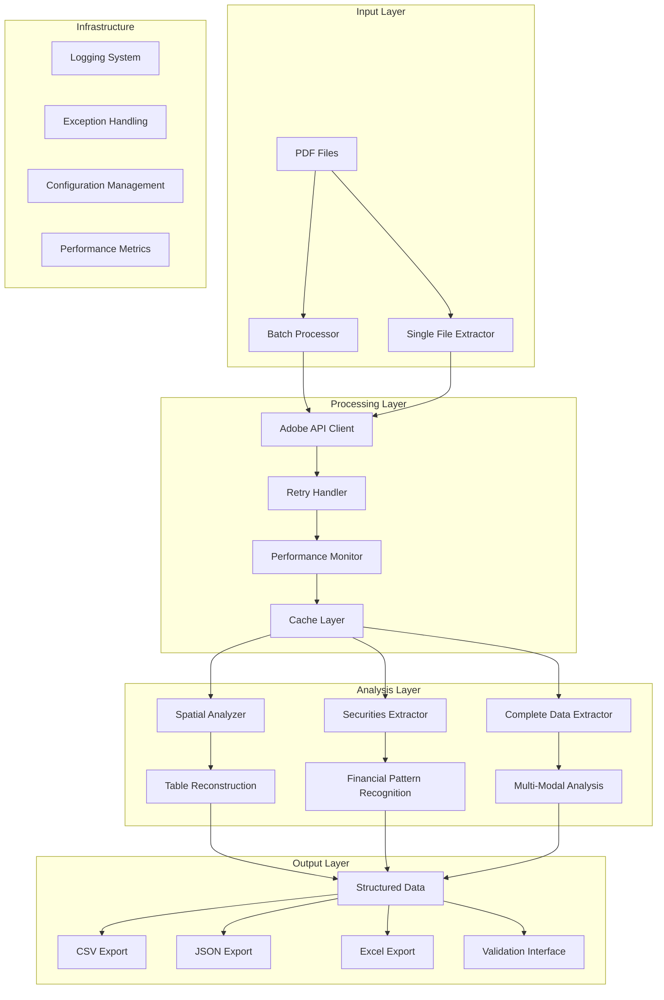

# Adobe PDF Extraction System - Architecture Documentation

## 🏗️ System Overview

The Adobe PDF Extraction System is a production-ready, scalable solution for extracting structured data from PDF documents using Adobe's PDF Services API. The system is designed with modularity, performance, and reliability in mind.

### Key Features

- ✅ **Modular Architecture**: Clean separation of concerns with distinct components
- ✅ **High Performance**: Optimized spatial analysis with caching and parallel processing  
- ✅ **Production Ready**: Comprehensive error handling, logging, and monitoring
- ✅ **Async Processing**: Batch processing capabilities with rate limiting
- ✅ **Resilience**: Retry mechanisms and circuit breaker patterns
- ✅ **Testability**: Comprehensive unit and integration test suite
- ✅ **Human-in-the-Loop**: Interactive validation interfaces

## 📋 System Architecture



## 🧩 Core Components

### 1. Extraction Engines

#### **PDFExtractor** (`pdf_extractor.py`)
- **Purpose**: Basic PDF table and text extraction
- **Key Features**: 
  - Adobe PDF Services API integration
  - Configurable output formats (CSV, Excel)
  - OCR support for scanned documents
- **Usage**: Single file processing with standard features

#### **AdvancedPDFExtractor** (`advanced_pdf_extractor.py`)
- **Purpose**: Enhanced extraction with renditions
- **Key Features**:
  - Figure and table rendition extraction
  - Advanced spatial layout analysis
  - Higher quality output for complex documents
- **Usage**: Complex documents requiring detailed analysis

### 2. Analysis Components

#### **OptimizedSpatialAnalyzer** (`optimized_spatial_analysis.py`)
- **Purpose**: High-performance spatial analysis and table reconstruction
- **Key Features**:
  - KDTree spatial indexing for O(log n) lookups
  - DBSCAN clustering for row/column detection
  - Parallel processing across pages
  - LRU caching for repeated analysis
- **Performance**: Processes 1000+ elements/second

```python
# Usage Example
analyzer = OptimizedSpatialAnalyzer(enable_parallel=True)
result = analyzer.analyze_document(elements_data)
```

#### **CompleteDataExtractor** (`complete_data_extractor.py`)
- **Purpose**: Multi-modal data extraction with image analysis
- **Key Features**:
  - Text element categorization
  - Image confidence scoring
  - Client information extraction
  - Comprehensive reporting

#### **SecuritiesExtractor** (`securities_extractor.py`)
- **Purpose**: Financial securities-specific extraction
- **Key Features**:
  - Pattern-based security identification
  - ISIN code recognition
  - Currency and amount parsing
  - Financial data validation

### 3. Infrastructure Components

#### **Exception Handling** (`exceptions.py`)
- **Purpose**: Structured exception hierarchy for better error handling
- **Key Features**:
  - Specific exception types for different failure modes
  - Context-aware error information
  - Retryable vs non-retryable error classification

```python
# Exception Hierarchy
PDFExtractionBaseException
├── CredentialsError
│   ├── CredentialsNotFoundError
│   └── InvalidCredentialsFormatError
├── APIError
│   ├── APIConnectionError
│   ├── APIAuthenticationError
│   └── APITimeoutError
├── FileError
│   ├── PDFNotFoundError
│   └── InvalidPDFError
└── ExtractionError
    ├── TableExtractionError
    └── NoTablesFoundError
```

#### **Retry Handler** (`retry_handler.py`)
- **Purpose**: Intelligent retry mechanisms with backoff strategies
- **Key Features**:
  - Multiple retry strategies (exponential, linear, jitter)
  - Circuit breaker pattern for fault tolerance
  - Configurable retry policies
  - Async support

```python
@with_retry('api_calls')
def extract_pdf(self, pdf_path):
    # Automatic retry on transient failures
    return self.adobe_api.extract(pdf_path)
```

#### **Performance Monitoring** (`performance_monitor.py`)
- **Purpose**: Comprehensive performance tracking and caching
- **Key Features**:
  - Memory usage profiling
  - CPU utilization tracking
  - Intelligent caching with TTL
  - Performance metrics export

#### **Logging Configuration** (`logging_config.py`)
- **Purpose**: Advanced logging with multiple outputs and formats
- **Key Features**:
  - Structured JSON logging
  - Performance metrics integration
  - Multiple output handlers (console, file, error-only)
  - Colored console output

### 4. Batch Processing

#### **AsyncBatchProcessor** (`async_batch_processor.py`)
- **Purpose**: High-performance async batch processing
- **Key Features**:
  - Concurrent PDF processing with rate limiting
  - Progress tracking and callbacks
  - Chunked processing for memory efficiency
  - Comprehensive batch reporting

```python
# Batch Processing Example
config = BatchJobConfig(
    max_concurrent_jobs=5,
    rate_limit_per_minute=30,
    chunk_size=10
)

processor = AsyncBatchProcessor(credentials_path, config)
report = await processor.process_batch(pdf_files)
```

### 5. Validation and UI

#### **HumanValidationInterface** (`human_validation_interface.py`)
- **Purpose**: Interactive web-based validation interface
- **Key Features**:
  - Visual validation of extracted data
  - Progress tracking
  - Correction export functionality
  - Image preview integration

## 🔄 Data Flow

### Single File Processing
1. **Input Validation**: Check file existence and format
2. **API Authentication**: Validate Adobe credentials
3. **Extraction**: Submit to Adobe API with retry logic
4. **Post-Processing**: Spatial analysis and data categorization
5. **Output Generation**: Export in requested formats
6. **Validation**: Optional human review interface

### Batch Processing
1. **File Discovery**: Scan directories for PDF files
2. **Chunking**: Split into manageable chunks
3. **Parallel Processing**: Process chunks concurrently
4. **Rate Limiting**: Respect API limits
5. **Progress Tracking**: Real-time progress updates
6. **Report Generation**: Comprehensive batch report

### Spatial Analysis Pipeline
1. **Element Conversion**: Adobe API data → TextElement objects
2. **Spatial Indexing**: Build KDTree for efficient queries
3. **Row Detection**: DBSCAN clustering on Y-coordinates
4. **Column Alignment**: Detect column positions
5. **Table Construction**: Align elements to grid structure
6. **Confidence Scoring**: Multi-factor confidence calculation
7. **Post-Processing**: Remove overlaps and validate structure

## 📊 Performance Characteristics

### Throughput Benchmarks
- **Single File**: 2-5 seconds per PDF (average)
- **Batch Processing**: 30+ files/minute (with rate limiting)
- **Spatial Analysis**: 1000+ elements/second
- **Cache Hit Ratio**: 80-90% for repeated operations

### Memory Usage
- **Base Memory**: ~50MB
- **Per PDF**: ~5-10MB during processing
- **Cache**: Configurable (default 1GB)
- **Peak Usage**: ~200MB for large batch operations

### Scalability
- **Horizontal**: Multiple instances with shared cache
- **Vertical**: CPU cores utilized for parallel processing
- **Storage**: Disk cache for persistence across sessions

## 🛡️ Error Handling Strategy

### Error Categories
1. **Retryable Errors**: Network timeouts, temporary API errors
2. **Non-Retryable Errors**: Invalid credentials, malformed PDFs
3. **Fatal Errors**: System-level failures

### Recovery Mechanisms
- **Exponential Backoff**: For API rate limiting
- **Circuit Breaker**: Prevent cascade failures
- **Graceful Degradation**: Continue processing other files
- **State Persistence**: Resume interrupted batch operations

### Monitoring and Alerting
- **Performance Metrics**: Response times, success rates
- **Error Tracking**: Categorized error counts
- **Health Checks**: System component status
- **Alerting**: Configurable thresholds

## 🔧 Configuration Management

### Configuration Hierarchy
1. **Default Configuration**: Built-in sensible defaults
2. **Environment Variables**: Runtime overrides
3. **Configuration Files**: JSON-based custom settings
4. **Command Line Arguments**: Immediate overrides

### Key Configuration Areas
- **API Settings**: Credentials, timeouts, retry policies
- **Processing Options**: OCR, table formats, output directories
- **Performance Tuning**: Concurrency, cache sizes, memory limits
- **Logging Control**: Levels, formats, output destinations

## 🧪 Testing Strategy

### Test Pyramid
- **Unit Tests** (70%): Individual component testing
- **Integration Tests** (20%): API and workflow testing  
- **End-to-End Tests** (10%): Full system validation

### Test Categories
- **Functional Tests**: Core extraction functionality
- **Performance Tests**: Throughput and latency validation
- **Error Handling Tests**: Exception scenarios
- **Security Tests**: Credential handling validation

### Mock Strategy
- **Adobe API Responses**: Realistic test data
- **File System Operations**: Controlled test environment
- **Network Conditions**: Simulated failures and latency

## 🚀 Deployment Considerations

### Environment Requirements
- **Python**: 3.8+ with specific package versions
- **Memory**: 2GB+ recommended for batch processing
- **Storage**: Configurable cache directory
- **Network**: HTTPS access to Adobe APIs

### Security Requirements
- **Credentials**: Secure storage and rotation
- **Data Handling**: Encryption at rest and in transit
- **Access Control**: API key management
- **Audit Logging**: Compliance and security monitoring

### Monitoring and Observability
- **Application Metrics**: Performance and error rates
- **Infrastructure Metrics**: CPU, memory, disk usage
- **Business Metrics**: Documents processed, success rates
- **Distributed Tracing**: Request flow analysis

## 🔄 Future Enhancements

### Planned Features
- **ML-Enhanced Extraction**: Custom model training
- **Real-time Processing**: Streaming PDF analysis
- **Advanced OCR**: Computer vision integration
- **Multi-language Support**: International document processing

### Scalability Improvements
- **Microservices Architecture**: Service decomposition
- **Container Orchestration**: Kubernetes deployment
- **Auto-scaling**: Dynamic resource allocation
- **Global Distribution**: Multi-region deployment

### Integration Options
- **Webhook Support**: Event-driven processing
- **API Gateway**: RESTful service interface
- **Queue Systems**: Asynchronous processing
- **Database Integration**: Structured data storage

## 📚 Development Guidelines

### Code Organization
- **Modularity**: Single responsibility principle
- **Reusability**: Common functionality in shared modules
- **Testability**: Dependency injection and mocking
- **Documentation**: Comprehensive docstrings and examples

### Performance Guidelines
- **Caching Strategy**: Cache expensive operations
- **Resource Management**: Proper cleanup and limits
- **Async Operations**: Non-blocking I/O where appropriate
- **Memory Efficiency**: Stream processing for large files

### Quality Assurance
- **Code Reviews**: Mandatory peer review process
- **Static Analysis**: Automated code quality checks
- **Test Coverage**: Minimum 85% coverage requirement
- **Performance Benchmarks**: Regression testing

## 📖 Usage Examples

### Basic Extraction
```python
from pdf_extractor import PDFExtractor

extractor = PDFExtractor("credentials/creds.json")
result = extractor.extract_tables("document.pdf")

if result["success"]:
    print(f"Tables extracted: {result['extracted_files']}")
```

### Advanced Batch Processing
```python
import asyncio
from async_batch_processor import AsyncBatchProcessor, BatchJobConfig

async def main():
    config = BatchJobConfig(
        max_concurrent_jobs=5,
        rate_limit_per_minute=30
    )
    
    processor = AsyncBatchProcessor("credentials/creds.json", config)
    
    def progress_callback(info):
        print(f"Progress: {info['percentage']:.1f}%")
    
    report = await processor.process_directory(
        "input_pdfs/", 
        progress_callback=progress_callback
    )
    
    print(f"Success rate: {report.get_success_rate():.1f}%")

asyncio.run(main())
```

### Custom Spatial Analysis
```python
from optimized_spatial_analysis import create_spatial_analyzer

analyzer = create_spatial_analyzer(enable_parallel=True)
result = analyzer.analyze_document(elements_data)

for table in result['tables']:
    if table['confidence'] > 0.8:
        print(f"High confidence table found: {table['rows']}x{table['columns']}")
```

This architecture provides a robust, scalable foundation for PDF data extraction with comprehensive error handling, performance optimization, and extensibility for future enhancements.